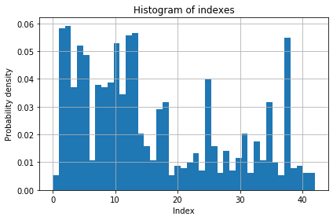
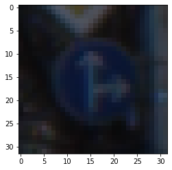
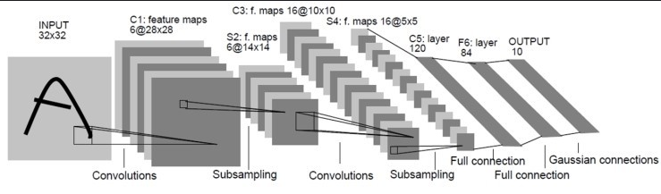
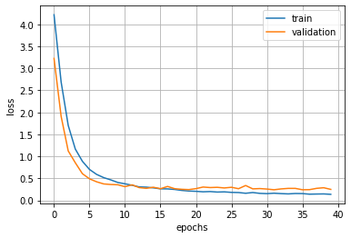
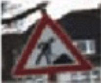
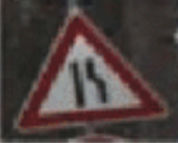
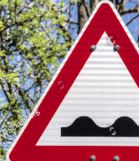
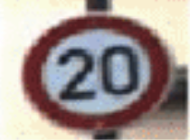

# **Traffic Sign Recognition** 

### **Build a Traffic Sign Recognition Project**

Here is process for the traffic sign recognition:
* Load the data set (see below for links to the project data set)
* Explore, summarize and visualize the data set
* Design, train and test a model architecture
* Use the model to make predictions on new images
* Analyze the softmax probabilities of the new images
* Summarize the results with a written report

---
### Data Set Summary & Exploration

I used the pandas library to calculate summary statistics of the traffic
signs data set:

* The size of training set is ?

* The size of the validation set is ?

* The size of test set is ?

* The shape of a traffic sign image is ?

* The number of unique classes/labels in the data set is ?

  ```
  n_train = y_train.size

  n_validation = y_valid.size
  n_test = y_test.size
  image_shape = X_train[0].size
  n_classes = np.unique(train['labels']).size
  
  ```


#### Include an exploratory visualization of the dataset.

This histogram shows the density of x_train. The histogram shows index = 2 has most probability density



  ```
max index:  [2]
max value:  0.0591355252408731
  ```

And the below image shows the example image of training set




### Data preprocessing

- First step: convert to gray scale
  - Expect network detect the traffic sign by shape and geometry characteristics not by color
- Second step: normalize the image
  - In order to suitable dataset for optimizer, I added the normalization
  - image data was 0~255 pixel. So, I used ```x_data = (x_data - 128)/128 ```  for zero-mean and equal variance.

### Model Architecture

My final model consisted of the following layers:





#### Type of optimizer, the batch size, number of epochs and any hyperparameters such as learning rate.

Here are my hyperparameters

1. EPOCHS: 40
2. BATCHES: 128
3. Optimizer: AdamOptimizer
4. Rate: 0.001
5. Loss: cross entropy

#### Validation set accuracy

My final validation set accuracy: 0.955

#### The approach to finding a solution

I used predefined LeNet Architecture for this project

The losses according to epoch is shown the below image



It looks some over-fitting to training data due to epochs, but it's affordable for satisfying the project goal

Finally, in the test set my test accuracy was

```Test Accuracy = 0.923```

In order to get the above result, I added drop-out with 0.2 keep_prob on the training data. In addition, I tuned the hyperparameters such as epochs, batch size without change the pre-defined architecture of the LeNet


#### Test a Model on New Images

Here are five German traffic signs that I found on the web:








#### Prediction result

Here are the results of the prediction:

| Image			        | Level			 |     Prediction	        					|
|:---------------------:|:---------------------------------------------:|-----------------------------------------------|
| Construction | Easy | Construction |
| rightturn | Easy | rightturn 	|
| bumpyroad | Hard, the image was cropped | Right-of-way at the next intersection |
| stopsign	| Easy | stopsign	|
| merge	   | Easy | merge					|
| speed_limit_20	| Easy | speed_limit_20 |


```

File: construction.png
Ground truth:25
Prediction:25
Top5 predicted labels:[25 35 30 22 20]
Top5 probabilities:[1.0000000e+00 1.3310424e-20 2.6476480e-21 6.9720819e-22 3.6496813e-22]


File: rightturn.png
Ground truth:33
Prediction:33
Top5 predicted labels:[33 35 37  1 11]
Top5 probabilities:[9.9999940e-01 5.6335909e-07 1.3687830e-08 7.4663982e-09 5.4428745e-10]


File: bumpyroad.png
Ground truth:22
Prediction:13
Top5 predicted labels:[13 35 25 12 39]
Top5 probabilities:[9.87589419e-01 1.13508888e-02 1.04088779e-03 1.09871935e-05
 5.58065403e-06]


File: speed_limit_20.png
Ground truth:0
Prediction:0
Top5 predicted labels:[ 0  4  1  8 29]
Top5 probabilities:[9.9969256e-01 2.7893586e-04 2.8305391e-05 6.2389852e-08 3.2154833e-08]


File: stopsign.png
Ground truth:14
Prediction:14
Top5 predicted labels:[14 38 13 12 17]
Top5 probabilities:[1.0000000e+00 3.0149911e-09 1.9597155e-09 5.9132388e-10 1.9145770e-10]


File: merge.png
Ground truth:24
Prediction:24
Top5 predicted labels:[24 29 20 27 23]
Top5 probabilities:[9.9999940e-01 3.7293580e-07 1.3942505e-07 3.8240120e-08 2.0799279e-08]


Total accuracy: 0.8333333333333334
```


As I expected, my model was good at easy data-set. However, it wasn't handle the exception case like cropped image. To enhance the model, I think data augmentation is necessary such as rotate, crop, jittering ... etc


